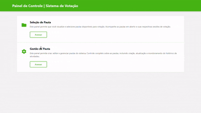
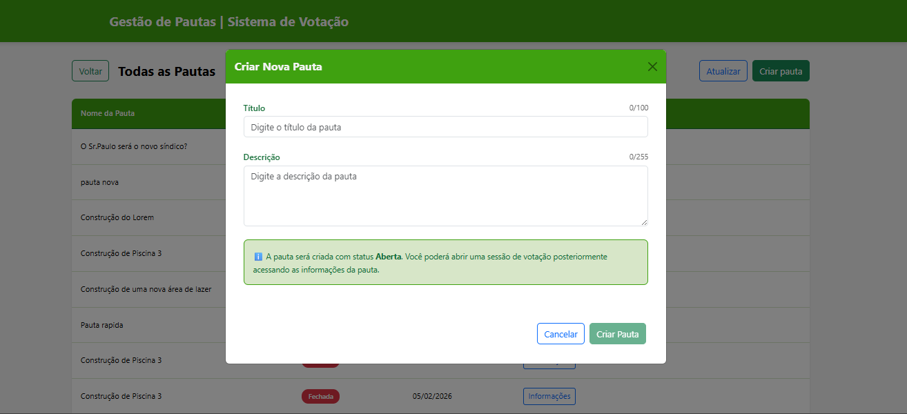
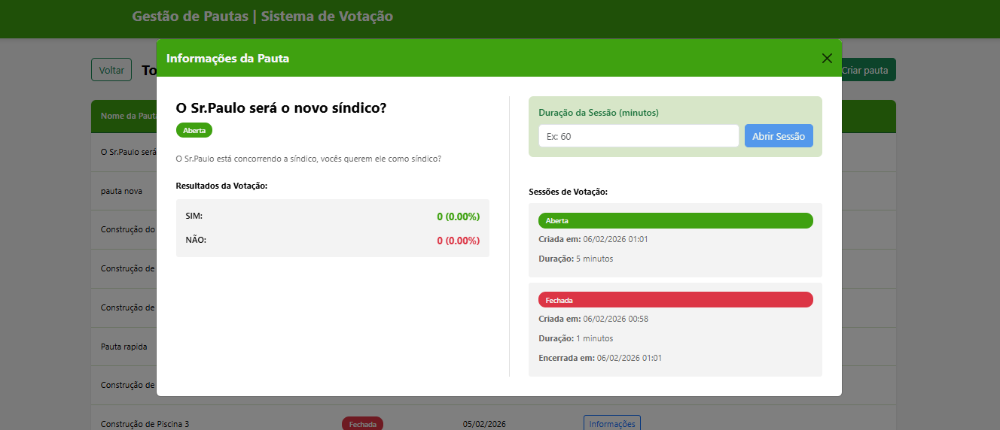
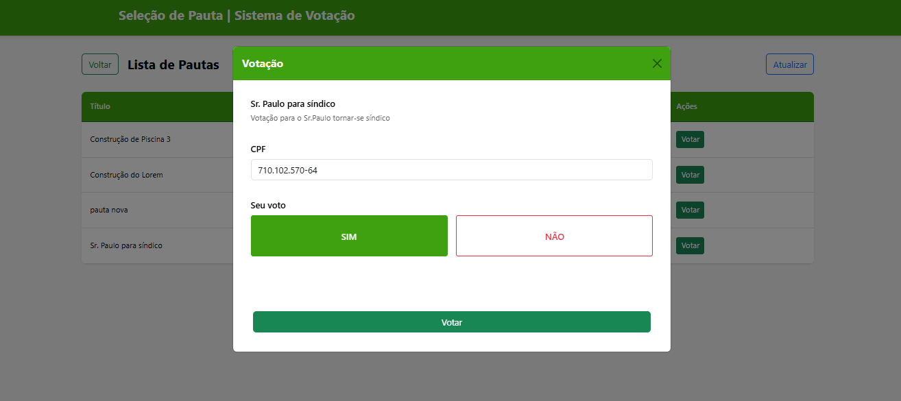
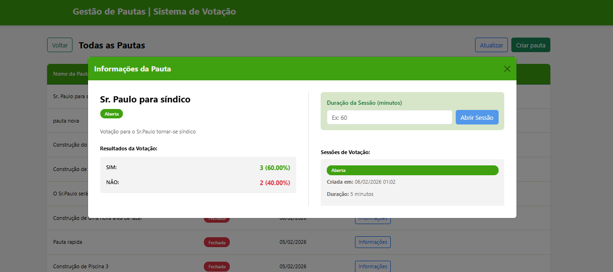
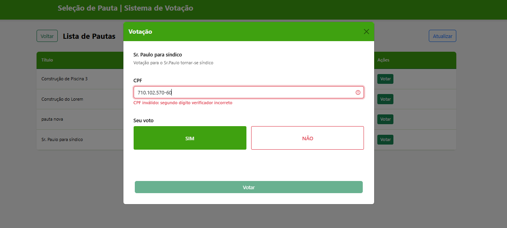
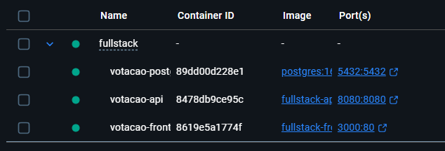

# 🗳️ Sistema de Votação - Fullstack

## 📚 Visão Geral

Sistema full stack para gestão de pautas e votação cooperativista, desenvolvido com **React** no frontend e **Spring Boot** no backend. A aplicação permite a criação de pautas, abertura de sessões de votação com tempo determinado e registro de votos por CPF.



### Fluxo Principal

1. **Gestão de Pautas**: Criação, listagem, visualização e exclusão de pautas
2. **Abertura de Sessões**: Configuração de sessões de votação com duração customizável
3. **Votação**: Registro de votos (Sim/Não) por CPF válido durante sessões ativas
4. **Resultados**: Visualização de resultados com percentuais e totalizações

---

## 🏗️ Arquitetura e Padrões

### Frontend (React + TypeScript)

A aplicação frontend segue os princípios de **Clean Architecture**, separando claramente as responsabilidades em camadas:

- **Presentation Layer**: Páginas e componentes React funcionais
- **Design System**: Componentes reutilizáveis (Button, Modal, Badge, Toast, etc.)
- **Services Layer**: Comunicação com API REST via Axios (HttpClient)
- **Shared Layer**: Utilitários (validação CPF, formatação de datas)
- **Types**: Interfaces TypeScript para contratos de dados

A aplicação utiliza Vite como bundler e ferramenta de build, escolhido por oferecer startup extremamente rápido, Hot Module Replacement (HMR) eficiente e uma configuração mais simples e moderna, aumentando a produtividade no desenvolvimento e reduzindo o tempo de feedback.

**Padrões adotados:**
- Clean Architecture
- SOLID (Single Responsibility, Open/Closed, Dependency Inversion)
- Componentização reutilizável
- Hooks personalizados
- Separação de estilos (arquivos `.styles.ts`)

### Backend (Spring Boot)

O backend utiliza **Clean Architecture** com separação em camadas:

- **Controllers**: Endpoints REST para comunicação com frontend
- **Use Cases / Services**: Lógica de negócio isolada
- **Domain**: Entidades e regras de domínio
- **Repositories**: Acesso a dados (JPA)
- **Infrastructure**: Configurações, validações externas

**Padrões adotados:**
- Clean Architecture
- SOLID
- DTOs para transferência de dados
- RESTful APIs
- Validação de dados com Bean Validation
- Tratamento centralizado de exceções

🔗 Projeto original do Backend:
O backend utilizado neste sistema tem como base o projeto DesafioVotacao, disponível no repositório: https://github.com/gabrielportugal/DesafioVotacao

---

## 🧠 Regras de Negócio

### Pautas

- Pautas podem ter status **OPEN** (Aberta) ou **CLOSED** (Fechada)
- Ao criar uma pauta, ela inicia com status **OPEN**
- Pautas fechadas não podem ser reabertas
- Pautas podem ser excluídas apenas quando estão **OPEN**



### Sessões de Votação

- Sessões de votação têm duração configurável (em minutos)
- Uma pauta pode ter múltiplas sessões de votação
- Sessões expiram automaticamente após o tempo configurado
- Sessões podem ter status **OPEN** ou **CLOSED**
- Apenas pautas abertas podem iniciar novas sessões



### Votação

- Cada CPF pode votar apenas **uma vez por sessão**
- Votos podem ser **SIM** ou **NÃO**
- CPF deve ser válido (validação de dígitos verificadores)
- Votos só são aceitos em sessões ativas (OPEN)
- Votos em sessões expiradas são rejeitados





### Validações

**Frontend:**
- Validação de CPF em tempo real (formato e dígitos)
- Máscaras de entrada (CPF: 999.999.999-99)
- Validação de campos obrigatórios
- Limitação de caracteres (título: 100, descrição: 255)



**Backend:**
- Validação de CPF duplicado por sessão
- Verificação de sessão ativa
- Validação de existência de pauta
- Tratamento de erros com mensagens claras

---
## ⚡ Instalação Rápida

### Pré-requisitos

- **Java 17+** (para o backend)
- **Maven 3.8+** ou Gradle
- **Node.js 20+** (para o frontend)
- **Postgree** (banco de dados)
- **Docker** (opcional)

### Crie os bancos manualmente
```bach
CREATE DATABASE votacao;
CREATE DATABASE votacao-teste;
```

### Backend (Spring Boot)

```bash
# Navegar para o diretório do backend
cd Api

# Compilar o projeto
mvn clean install

# Executar a aplicação
mvn spring-boot:run
```

A API estará disponível em: `http://localhost:8080`

### Frontend (React)

```bash
# Navegar para o diretório do frontend
cd Frontend

# Criar o arquivo de variáveis de ambiente
# Copie o .env.example e renomeie para .env
cp .env.example .env

# Instalar dependências
npm install

# Iniciar o servidor de desenvolvimento
npm run dev
```

A aplicação estará disponível em: `http://localhost:5173`


## 🐳 Docker



### 🚀 Como usar
#### Subir toda a aplicação (banco + API + frontend):

```bash
docker-compose up --build
```

#### Acessar:

- **Frontend**: http://localhost:3000
- **Backend API**: http://localhost:8080
- **PostgreSQL**: localhost:5432

### 📦 Serviços

- **postgres**: Banco de dados PostgreSQL 16
- **api**: Backend Spring Boot (porta 8080)
- **frontend**: Frontend React (porta 3000)

### ⚙️ Configurações

As configurações podem ser alteradas no arquivo `docker-compose.yml`:

- Portas
- Variáveis de ambiente
- Credenciais do banco
- Memória da JVM

> 🔍 Healthchecks: Todos os serviços têm healthchecks configurados para garantir que estejam prontos antes de iniciar serviços dependentes.
---

## 🌿 Estratégia de Branches (Git)

O projeto utiliza **Git Flow** para organização de branches:

- **`main`**: Código em produção, sempre estável
- **`develop`**: Branch de integração para desenvolvimento
- **`feature/*`**: Novas funcionalidades (ex: `feature/vote-modal`)
- **`fix/*`**: Correções de bugs (ex: `fix/cpf-validation`)
- **`hotfix/*`**: Correções urgentes em produção
- **`release/*`**: Preparação para nova versão

### Fluxo de trabalho

```bash
# Criar nova feature
git checkout -b feature/nome-da-feature develop

# Finalizar feature
git checkout develop
git merge feature/nome-da-feature
git branch -d feature/nome-da-feature
```

---

## 🛠️ Ferramentas e Tecnologias

### Frontend

| Tecnologia | Versão | Descrição |
|------------|--------|-----------|
| React | 19.2.0 | Biblioteca para interfaces |
| TypeScript | 5.9.3 | Superset JavaScript tipado |
| Vite | 7.2.4 | Build tool moderna |
| React Router | 7.13.0 | Roteamento client-side |
| React Bootstrap | 2.10.10 | Componentes UI |
| Axios | 1.13.4 | Cliente HTTP |
| ESLint | - | Linter para código |

**Bibliotecas de estilo:**
- Bootstrap 5.3.8
- Google Fonts (Nunito)

### Backend

| Tecnologia | Descrição |
|------------|-----------|
| Spring Boot | Framework para APIs REST |
| Java 17+ | Linguagem de programação |
| Spring Data JPA | Persistência de dados |
| Maven | Gerenciador de dependências |
| PostgreSQL | Banco de dados |
| Lombok | Redução de boilerplate |
| Bean Validation | Validação de dados |

---

## 👤 Autor

**Gabriel Portugal**  
💼 [Portfólio](https://gabrielportugal.web.app/)  
💻 [LinkedIn](https://www.linkedin.com/in/gabriel-portugal-b26a13188/)

---
## 📝 Licença

MIT © Gabriel Portugal
